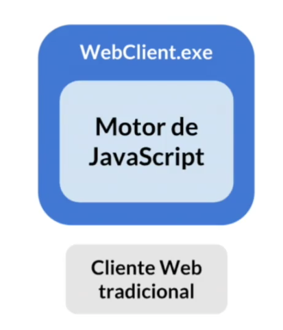
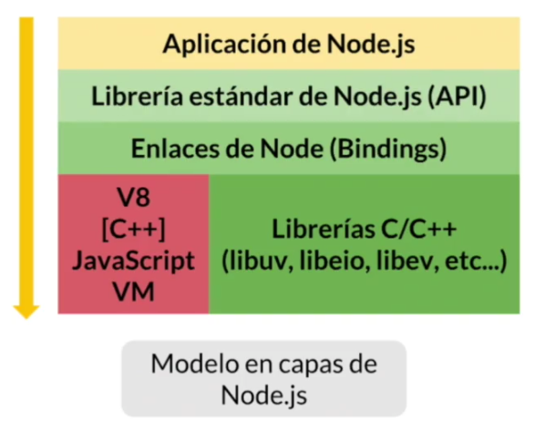
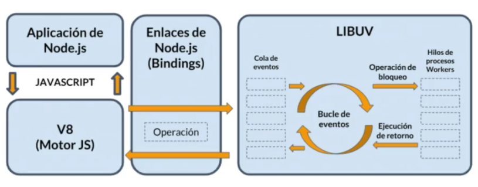
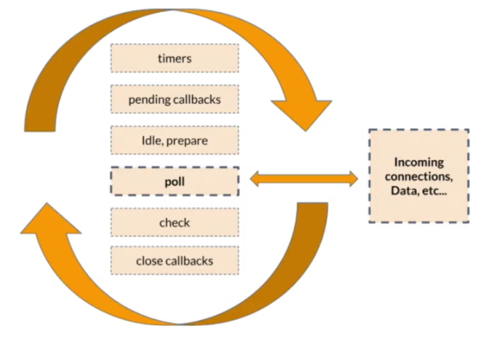
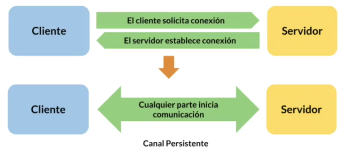

# NodeJs

## Que es Node.js
- Ambiente de ejecución de codigo.
- Proyecto comunitario
- Cambio de Paradigma.

## Antecedentes
- Precio a Node.js JavaScript fue un lenguaje con uso exclusivo solo en browsers
- 1995 - 2009
    - JavaScript solo para Web Clients.
    - Poca Madurez.
- 2009:
    - Ryan Dahl - Creador de Node.js
    - Motivado por la libreracion del codigo V8 de Google
    - Fue una propuesta para desarrollo de alicaciones fuera de clientes web.

## Caracteristicas
    - Libre
    - RealTime
    - Orientado a eventos
    - Asincrono
    - Multi-Plataforma.
    - Serve Side
    - Robusto
    - Escalable
    - Expandible
    - No Bloqueante

## Actualidad
    - Desde su primera version, ha obtenido una gran popularidad y es mantenido por: Node Foundation
    - version LTS y version Development

## Evolucion
- Node.js ha recorrido un largo camino entre versiones, añadido caracteristicas en cada iteración
- En las siguientes versiones se estaran añadiento algunas funciones interesantes como:
    - Soporte para HTTP/2
    - Mejora de modulos

## Arquitectura
    - Node es un aplicativo que hace uso de librerias para procesar y ejecutar codigo JavaScript.

- Browsers y sus motores
    - Chrome - V8
    - Edge - Chakra
    - Firefox - SpiderMonkey

- Node.js se planteo como una aplicacion que haria uso de un motor de JavaScript.
- La opcion elegida fue v8, motor de Google Chrome, escrito en C++.

- Binding son los enlaces que existen los niveles de alto nivel con los que estan a muy bajo escritos en otros lenguajes como C++.

- **Sistema de NodeJS**

- **Bucle de Eventos**

## Casos de uso
- Node.js obtiene su maximo provecho en desarrollo de aplicaciones de red.
    - NRTA - Not Real Time Applications
    - RTA - Real Time Applications

### NRTA
- En las que el cliente realiza una petición especifica al Servidor, esperando una sola respuesta.

Cliente -> cliente realiza una petición -> Servidor
Cliente <- servidor retorna respuesta   <- Servidor

- Ejemplos 
    - Servidor API (HTTP/S)
    - Servidor de Sitio Web (HTTP/S)
    - Servidor de servicios de red (DNS)
    - Servidor Proxy 
    - Etc
### RTA
- En las que el cliente solicita al servidor el establecimiento de un canal bidireccional, en donde cualquie parte puede iniciar la comunicacion.

- Ejemplos
    - Comunicaciones en tiempo real (Chats, VoIP, Video)
    - Monitoreo de datos (DashBoards)
    - Juegos en linea
