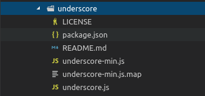
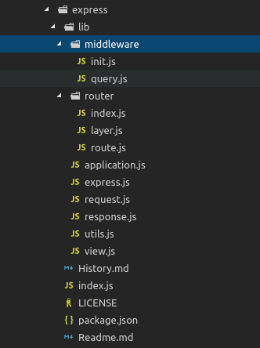

# Introducción

## Ques es un paquete?

- Es muy importante diferenciar entre un modulo y un paquete.
    - Un modulo es un unico archivo de javascript que tiene alguna funcionalidad
    - Un paquete es un directorio con uno o mas modulos dentro de el y un archivo package.json el cual tiene metadatos
      sobre el paquete.

### Tipos de paquetes

- Simples: Teniendo un solo archivo como underscore

```bash
npm i underscore
```



- Complejos: Teniendo varios archivos y subdirectores como express

```bash
npm i express
```



## Uso tipico de npm

- Uso tipico y mas comun es para poder intalar las dependencias, iniciar o ejecutar los test de un proyecto.

```bash
git clone https://github.com/joeeames/trip-to-mars-typical triptomars
cd triptomars
# npm i
npm install
npm start
npm test
```

- Los scripts `npm start` o `npm test` estan declarados en el metadato `scripts` del archivo package.json del proyecto.
  

## npm help

- Para poder saber mas de `npm` es comun utilizar los comandos para mostrar la documentación de la ayuda.

```bash
# Mostrar una lista de los comandos tipicos de npm pero con una información menor
npm -h

# Mostrar la ayuda espefifica sobre el comando install
npm install -h

# Mostrara una ayuda mas detallada del comando install
# Se puedo buscar el comando en google y nos redirecionara a la documentacion oficial del comando.
# https://docs.npmjs.com/cli/install
npm help install 

# Buscara en la documentacion oficial de npm y mostrara una lista en donde aparezca la palabra remove
npm help-search remove
```

- Configurar para que el manual detallado aparezca en el navegador se realiza configurando el viewer.

```bash
# Mostramos la configuracion
npm config ls -l
.
.
.
viewer = "man"

# Configurar la visualizacion en navegador o modo manual
npm config set viewer=browser
npm config set viewer=man
npm config delete viewer
```

## Shortcuts

- Un documento a tomar en cuenta y que pueder visitar varias veces es la pagina de
  configuraciones [https://docs.npmjs.com/misc/config](https://docs.npmjs.com/misc/config) en donde se encontrar los
  shortcuts para los comandos mas largos de npm es una referencia que podra visitar varias veces para poder memorizar y
  aprenderselos.

```bash
    -v: --version
    -h, -?, --help, -H: --usage
    -s, --silent: --loglevel silent
    -q, --quiet: --loglevel warn
    -d: --loglevel info
    -dd, --verbose: --loglevel verbose
    -ddd: --loglevel silly
    -g: --global
    -C: --prefix
    -l: --long
    -m: --message
    -p, --porcelain: --parseable
    -reg: --registry
    -f: --force
    -desc: --description
    -S: --save
    -P: --save-prod
    -D: --save-dev
    -O: --save-optional
    -B: --save-bundle
    -E: --save-exact
    -y: --yes
    -n: --yes false
    ll and la commands: ls --long
```

## Crear un package.json

- Hay dos tipos de proyectos que se pueden crear
    - Proyectos para usuarios, sitios web, aplicaciones web
    - Paquetes para terceros para que otros desarrolladores lo comsuman.

### Razon para crear package.json

- Rastrear dependencias que esta utilizando
- Crear algunos scripts y no utilizar gulp o grunt

- Al crear un proyecto con el comando `npm init` hay que seguir una serie de preguntas. Esas preguntas cambiaran con las
  versiones de npm aunque no seran tan grandes los cambios, las preguntas pueden tener valores por defecto y solo al
  precionar enter tomara ese valor pero si se lo quiere cambiar se escribe el cambio que se quiere realizar y al
  finalizar las preguntas siempre te pedira que confirmes el package.json generado.

```bash
mkdir 
npm init

This utility will walk you through creating a package.json file.
It only covers the most common items, and tries to guess sensible defaults.

See `npm help json` for definitive documentation on these fields
and exactly what they do.

Use `npm install <pkg>` afterwards to install a package and
save it as a dependency in the package.json file.

Press ^C at any time to quit.
package name: (web) 
version: (1.0.0) 
description: Aplicacioon web
entry point: (index.js) 
test command: 
git repository: 
keywords: web
license: (ISC) MIT
About to write to /home/gnujavasergio/github/node-experiments/2-npm/examples/1-introduction/web/package.json:

{
  "name": "web",
  "version": "1.0.0",
  "description": "Aplicacioon web",
  "main": "index.js",
  "scripts": {
    "test": "echo \"Error: no test specified\" && exit 1"
  },
  "keywords": [
    "web"
  ],
  "author": "Sergio Antonio Ochoa Martinez <gnu.java.sergio@gmail.com> (https://twitter.com/gnujavasergio)",
  "license": "MIT"
}

Is this OK? (yes) yes
```

- Cear el archivo con todos los valores por defecto

```bash
npm init -y
```

- Configurar los valores por defecto npm

```bash
npm set init.author.email "gnu.java.sergio@gmail.com"
npm set init.author.name "Sergio Antonio Ochoa Martinez"
npm set init.license "MIT"
npm init -y
```

## Configuraciones por defecto

- Al crear un nuevo proyecto para no estar escribiendo siempre todas las respuestas a las preguntas realizadas
  por `npm init` se puede terner respuestas por defecto para todos nuestros proyectos y eso se realiza con el
  comando `npm cofig set [key]`.

```bash
# Para listar la configuracion
npm config ls -l

# Modificar el valor con npm config set [key] value
npm config set init.author.email "gnu.java.sergio@gmail.com"
npm config set init.author.name "Sergio Antonio Ochoa Martinez"
npm config set init.author.url "https://twitter.com/gnujavasergio"

# Modificar el valor con npm set [key] value
npm set init-license 'MIT'

npm config set  viewer = "man"

# Para visualiar el valor que tiene una llave en la configuración
npm get init-license

# Para eliminar la configuracion
npm config delete init-license
```

- Todas las modificaciones que se realiza se guardan en el archivo /home/user/.npmrc

## Instalar paquetes

- Para instalar paquetes al proyecto y guardarlos en el **package.json** comunmente se tiene dos opciones:
    - Dependencias de produccion
    - Dependencias de desarrollo

### Dependencias de producción

- Paquetes requeridos para la aplicacion cuando esta en producción
- Metadata **dependencies**

```bash
# Comando Completo
npm install <package-name> [--save-prod]
# Comando corto
npm i <package-name> -S
```

### Dependencias de Desarrollo

- Paquetes requeridos para la aplicación cuando está en desarrollo y testing.
- Metadata **devDependencies**

```bash
# Comando Completo
npm install <package-name> --save-dev
# Comando corto
npm i <package-name> -D
```

### Dependencias Opcionales

- Metadata **optionalDependencies**

```bash
npm install <package-name> --save-optional
npm i <package-name> -O
```

### Simular la instalacion de dependencias

```bash
npm install <package-name> --dry-run
```

### Dependencias forzadas

```bash
npm install <package-name> --force --save-dev
npm install <package-name> -f -D
```

## Listar los paquetes instalados

- Podemos mostrar una lista de las dependencias de nuestro proyectro o dependencias globales con los siguientes comandos

### Comandos para paquetes de proyecto

```bash
# Listar los paquetes de un proyecto entrando al directorio node_modules
cd node_modules
ls -la 

# Muestra una lista detallada de los paquetes en forma de arbol 
npm list

# Muestara una lista con solo el primer nivel de las dependencias principales
npm list --depth 1

# Muestra una lista con solo las dependencias principales o las añadidas por nosotros
npm list --depth 0

# Mostrar las dependencias solo de desarrollo
npm list --depth 0 --dev true
```

### Comandos para paquetes globales

```bash
# Muestra una lista detallada de todos los paquetes instalados globalmente
npm list --global true

# Muestra una lista de los paquetes instaldos sin nung detalle de las dependencias que tiene
npm list --global --depth 0

# Muestra con mas detalles los paquetes. Nombre, descripción, repositorio, pagina web
npm list --global --depth 0 --long true

# Muestrar la informacion en formato json
npm list --global --depth 0 --long true --json true
```

## Instalar paquetes globalmente

- Un paquete se instala globlamente para poder utilizarlo en linea de comando y no estar instalando en cada proyecto

```bash
# Para instalar en forma global se utiliza el flag -g
npm install -g @angular/cli

# Al instalar globalmente angular no permite utilizar proyecto de angular por linea de comandos.
ng new blog
```

## Desintalar y Eliminar un paquete

```bash
# Para desintalar el paquete
npm uninstall express

# Para desintalar paquete y eliminar el paquete del archivo package.json
# Comando completo
npm uninstall express --save

# Para desintalar paquete y eliminar el paquete del archivo package.json
# Comando corto
npm un express -S

## Para desintalar paquete sin eliminar el paquete del archivo package.json
npm uninstall webpack --no-save
```

## Instalar versiones especificas

- Se instala una version especifica cuando tenemos un proyecto que si no se utiliza la version adecuada puede que el
  proyecto se rompa o cause errores.
- Version de un paquete 1.8.25 (Major, minor, Patch)
    - **Major**: Aumente cuando los cambios realizados ya no tienen soporte para las versiones posteriores.
    - **Minor**: Aumenta cuando se añade una nueva funcionalidad
    - **Patch**: Aumenta cuando se soluciona un bug, un error de alguna funcionalidad

[versiones](images/image4.png)

```bash
# Instalara la ultima versión del paquete
npm i underscore

# Instalar una version especifica
npm i underscore@1.8.1

# Instalar la ultima version minor
npm i underscore@1.7.x
npm i underscore@1.7

# Instalar la ultima version major
npm i underscore@1.x
npm i underscore@1

# Instalar una version en un rango
npm i underscore@">=1.1.0 <1.8.x" -S

# Instalar una version exacta y guardalo en package.json para solo descargue esa version
npm install underscore@">=1.1.0 <1.8.x" --save --save-exact
npm i underscore@">=1.1.0 <1.8.x" -S -E
```

## Instalar dependencias existentes

- Cuando un usuario tiene que ejecutar el proyecto solo tiene que instalar las dependencias del proyecto utilizando el
  comando `npm i`.

```json
{
  "_comment": "Se instalara la versión exacta la 1.7.0",
  "dependencies": {
    "underscore": "1.7.0"
  }
}
```

```json
{
  "_comment": "Se instalara la ultima versión minor(1.7.x o 1.7)",
  "dependencies": {
    "underscore": "~1.7.1"
  }
}
```

```json
{
  "_comment": "Se instalara la ultima versión major (1.x o 1)",
  "dependencies": {
    "underscore": "^1.7.1"
  }
}
```

## Actualizar paquetes

- Para actualizar los paquetes se utiliza `npm update` o `npm u`

```bash
# Actualizara todas la dependencias en su version minor tanto dependencias de producción y desarrollo
npm update 

# Solo Actualizara la dependencias de desarrollo
npm update --dev

# Solo Actualizara la dependencias de producción
npm update --prod

# Actualizar una paquete especifico
npm update underscore

# Actualizar paquetes globales
npm update -g @vue/cli@3.8.4
```

- Un comando para saber si tus dependencias necesitar ser actualizadas o si ya es 
  necesario actualizarlo

```bash
# Output especifico
npm outdate

vPackage      Current  Wanted  Latest  Location                  Depended by
json-server   0.15.0  0.15.1  0.16.3  node_modules/json-server  jsnpm

# Output detallado
npm outdate --dd
```

- Actualizar paquetes

```bash
# Actualiza todos los paquetes del proyecto 
npm update

# Actualiza un paquete espesifico 
npm install json-server@latest
```

## Solucionar problemas
- Un problema es que no esten escritas correctamente los comandos
```bash
# Para mostrar el error que salga a detalle
npm run build --dd
```

- Otro problema es que los paquetes no esten correctamente instalados o que esten en cache.
```bash
npm cache clean --force
npm cache verify
```

- Para eliminar la carpeta node_modules con npm
```bash
npm install -g rimraf

# Borrar la carpeta node_modules
rimraf node_modules
```

## Seguridad
- https://snyk.io/ : Proyecto para tener nuestros paquetes actualizados
- Como desarrolladores somo responsables de que nuestro proyecto este actualizado y no se
instale ningun paquete malisioso.
  
```bash
npm audit
npm audit --json

# Actualizar todos los paquetes y sus dependencias y soluciona todas las vulneravilidades que tenga el proyecto
npm audit fix

## Forzar la actual
npm audit fix --force
```