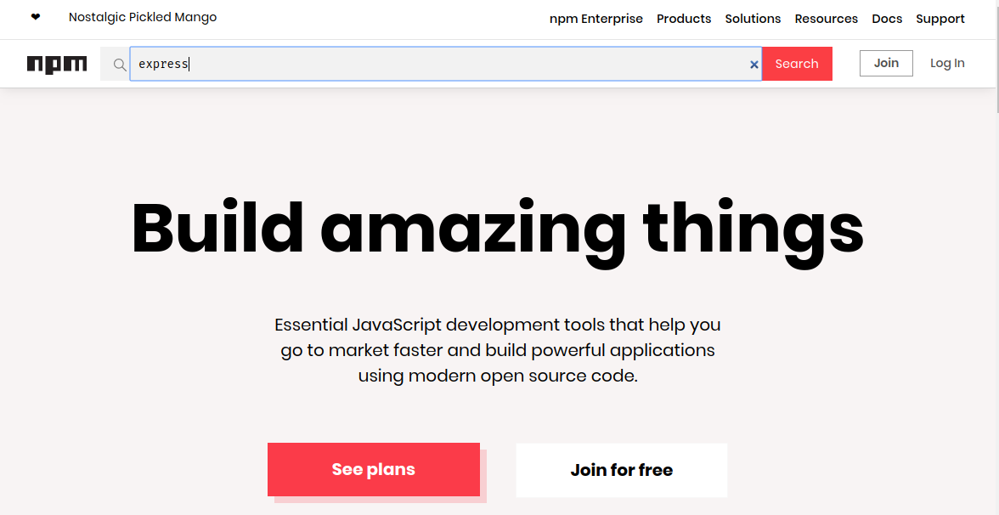

# Conceptos avanzados

## Instalar paquetes desde un repositorio de git

- Instalar desde un repositorio git es nececesario cuando no conocemos el nombre del paquete o es una Fork del proyecto
  principal que no tiene el nombre

```bash
# npm instal express
npm install https://github.com/expressjs/express.git
```

**Nota:** La instalación se lo puede hacer desde cualquier URL que almacene un paquete.

## Instalar paquetes desde gist

- [https://gist.github.com](https://gist.github.com)
- Se puede instalar porciones de codigo como modules desde gist esto es posible por el hash que tiene asignado cada
  gist.
- **Importante** para que el gist se pueda instalar como paquete si o si tiene que tener el archivo package.json

```bash
# Forma completa
npm install gist:f1d6d172f400776ac28dbcb99cd28ee8 --save
#Forma corta
npm i gist:f1d6d172f400776ac28dbcb99cd28ee8 -S
```

- [Ejemplo1](../examples/2-advanced/ejemplo1)

## Instalar paquetes desde una Carpeta

- Esta forma de instalar es muy necesario y util cuando los paquetes que crea una empresa no se quiere publicar a npm ya
  que son privados.
- Muy importante el paquete tiene que estar en una carpeta podria ser sincronizada con dropbox, google drive.

```bash
npm install /home/gnujavasergio/npm/underscore --save
```

- [Ejemplo2](../examples/2-advanced/ejemplo2)

## El registro de npm

- [https://www.npmjs.com/](https://www.npmjs.com/)
- Es una lista de todos los paquetes que se han publicado a traves de npm.
- Para poder publicar en npm la pieza clave es el archivo package.json
- Cualquier busqueda que se realizar en la pagina de [npm](https://www.npmjs.com/) se esta realizando la busqueda en el
  archivo package.json de cada paquete.
- Para poder ver el registro de un paquete se escribe la url `http://registry.npmjs.com/` seguido del nombre del
  paquete, esto devolvera el registro en formato json.
    - **Ejemplo**: [http://registry.npmjs.com/express](http://registry.npmjs.com/express)

- Para poder ir directamente a la pagina del paquete se escribe la url `npm.im` seguido del nombre del paquete.
    - **Ejemplo**: `npm.im/express`

## Buscando paquetes

- Una de las opciones es buscar por linea de comandos pero este no es tan recomendable porque tarda en realizar la
  busquedda.

```bash
# Buscar paquetes por linea de comandos
npm search underscore
```

- Otra opción para realizar las busquedas es hacer directamente por campo de busqueda de la pagina
  de [npm](https://www.npmjs.com).
  

## Pruning

- El comando `npm prune` sirve para poder identificar los paquetes instalados que ya no estan declarados en package.jon
  esto puede pasar por varios motivos que solo se instalo el paquete para probar o porque se elimino el paquete del
  archivo package.jon.

```bash
# 1. Listamos los paquetes instalados
npm list --depth 0
ejemplo3@1.0.0 ~node-experiments/2-npm/examples/2-advanced/ejemplo3
├── express@4.17.1
├── gulp@4.0.2 extraneous
├── jshint@2.10.2
├── lodash@3.10.1
└── underscore@1.9.1

npm ERR! extraneous: gulp@4.0.2 ~node-experiments/2-npm/examples/2-advanced/ejemplo3/node_modules/gulp

# Se puede verificar que gulp es un archivo estraño y no esta declarado en el archivo package.json
# Eliminamos todos los archivo que no se utilizan y que no necesitamos, realizamos una limpieza
npm prune

# Listamos nuevamente los paquetes instalados
npm i
npm list --depth 0
ejemplo3@1.0.0 ~node-experiments/2-npm/examples/2-advanced/ejemplo3
├── express@4.17.1
├── jshint@2.10.2
├── lodash@3.10.1
└── underscore@1.9.1
```

- Otras utilidades

```bash
# Puede eliminar y limpiar un paquete especifico
npm prune gulp

# Eliminar todos los paquetes de desarrollo y dejar solo los de producción
npm prune --production
```

- [Ejemplo3](../examples/2-advanced/ejemplo3)

## El comando npm repo

- Este comando nos redirecciona y nos abre el navegador para poder visualizar el repositorio oficial del paquete que
  estamos buscando.

```bash
# Paquetes de proyecto
npm repo express

# Paquetes globales
npm repo @vue/cli
```

## Actualizar NPM

- **Importante**: Para actualizar npm es necesario siempre hacerlo como administrador sino se lo hace de esa manera
  puede romper el npm.

```
npm install -g npm
```

## Usando scripts simples

- [Documentación](https://docs.npmjs.com/misc/scripts)

```json
{
  "name": "ejemplo3",
  "version": "1.0.0",
  "description": "",
  "main": "index.js",
  "dependencies": {
    "express": "^4.13.3",
    "lodash": "^3.10.1",
    "underscore": "^1.9.1"
  },
  "devDependencies": {
    "jshint": "^2.8.0"
  },
  "scripts": {
    "start": "node server.js",
    "test": "node test.js",
    "serve": "http-serve"
  },
  "author": "Joe Eames",
  "license": "ISC"
}

```

- Ejecutar los scripts

```bash
npm start
npm test
# Ejecutar con el comando run cuiando el script no utiliza node en el script.
npm run serve
```

- [Ejemplo4](../examples/2-advanced/ejemplo4)