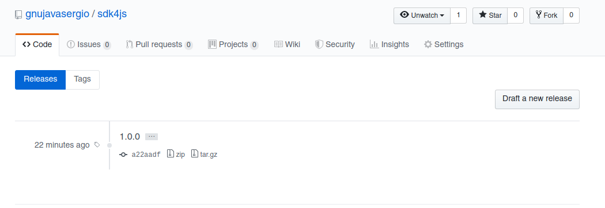

# Packages

# Configurar tu usuario.

- Primero se tiene que crea una cuenta en [https://www.npmjs.com](https://www.npmjs.com).
- Segundo configurar tu cuenta en la consola.

```bash
npm adduser
Username: gnujavasergio
Password: 
Email: (this IS public) gnu.java.sergio@gmail.com
Logged in as gnujavasergio on https://registry.npmjs.org/.
```

## Preparar tu proyecto para publicarlo

- Pasos

```bash
# Crear la carpeta del proyecto
mkdir sdk4js
#  Ingresar a la carpeta
cd sdk4js
# Inicializar un proyecto de git
# Nota: Ya se tiene que tener creado el repositorio en github
git init
git remote add origin https://github.com/gnujavasergio/sdk4js.git
# Visualizar si se añadio correctamente
git remote -v
origin  https://github.com/gnujavasergio/sdk4js.git (fetch)
origin  https://github.com/gnujavasergio/sdk4js.git (push)
# Iniciamos el proyecto de npm
npm init
This utility will walk you through creating a package.json file.
It only covers the most common items, and tries to guess sensible defaults.

See `npm help json` for definitive documentation on these fields
and exactly what they do.

Use `npm install <pkg>` afterwards to install a package and
save it as a dependency in the package.json file.

Press ^C at any time to quit.
package name: (sdk4js) 
version: (1.0.0) 
description: sdk for openkm
entry point: (index.js) 
test command: 
git repository: (https://github.com/gnujavasergio/sdk4js.git) 
keywords: sdk
license: (MIT) 
About to write to /home/gnujavasergio/github/projects/node/sdk4js/package.json:

{
  "name": "sdk4js",
  "version": "1.0.0",
  "description": "sdk for openkm",
  "main": "index.js",
  "scripts": {
    "test": "echo \"Error: no test specified\" && exit 1"
  },
  "repository": {
    "type": "git",
    "url": "git+https://github.com/gnujavasergio/sdk4js.git"
  },
  "keywords": [
    "sdk"
  ],
  "author": "Sergio Antonio Ochoa Martinez <gnu.java.sergio@gmail.com> (https://twitter.com/gnujavasergio)",
  "license": "MIT",
  "bugs": {
    "url": "https://github.com/gnujavasergio/sdk4js/issues"
  },
  "homepage": "https://github.com/gnujavasergio/sdk4js#readme"
}


Is this OK? (yes) yes

# Subirmos el codigo al respositorio
git add -A
git commit -m "Configuración del proyecto"
git push origin master
```

## Crear nuestro paquete en global

- Crear el proyecto en `src/`
- Crear el archivo **bin/global.js** si queremos que se necesite instalar como un paquete global

```javascript
#!/usr/bin/env node
let random = require('../src/index.js');

random.randomMsg();
```

- Modificar package.js para habilitar el paquete glogal y añadirle con comando como se lo llamara por consola

```json
{
  "license": "MIT",
  "bin": {
    "random-msg": "./bin/global.js"
  },
  "preferGlobal": true
}
```

## Publicar

- Antes de publicar nuestro paquete tenemos que probarlo si esta bien y esto lo hacemos localmente.

```bash
random-messages $
# Ayuda para saber si nuestro paquete no tenga vulneravilidades
sudo npm link 

# Actualizar nuestro paquete local 
npm install -g /home/sochoa/github/node-experiments/2-npm/projects/random-messages
```

```bash
# Publicar el paquete
npm publish
# Resultado mostrar el nombre del paquete con la version que esta en el package.json
+ sdk4js@1.0.0

# Despues de publicar el paquete se puede utilizar varios comandos
# Obtener la información del paquete
npm info sdk4js 
# Redireccionar al repositorio del proyecto
npm repo sdk4js

# Para poder ir directamente a la pagina del paquete npm.im/sdk4js
sudo apt-get install w3m w3m-img
w3m -version
w3m npm.im/sdk4js

# Cuando realizar una publicacion de una version es necesario realizar un tag en git para poder tener un punto de regreso.
git tag 1.0.0
git push --tags
```



## Publicar una actualización

- Para realizar una actualizacion tiene haber cambios y estos cambios podrian ser
    - major
    - minor
    - patch
- El cambio de las versiones en el archivo package.json se podria hacer manualmente pero tambien se le puede dar la
  responsabilidad a npm para que lo haga.

```bash
# Primero realizamos cambios
git add -A
git commit -m "Module exports"

# npm version [major|minor|patch]
npm version patch
v1.0.1

# Al realizar npm version patch esto realizar 3 cosas
# 1. Modifica el metadato de la versión en el package.json
# 2. Realiza un commit con un commentario de la version 
# 3. Crear un tag con el nombre de la version que se cambio
git tag
1.0.0
v1.0.1

# Ahora su puedo subir el tag y subir el codigo modificado
git push --tags
git push origin master

# Por ultimo se tiene que publicar la actualizacion
npm publish
+ sdk4js@1.0.1
```

## Lanzamiento de una versión beta

- Se realiza los cambios en el codigo
- Modificamos la version manualmente `1.1.0-beta.0`

```json
{
  "name": "sdk4js",
  "version": "1.1.0-beta.0",
  "description": "sdk for openkm",
  "main": "index.js",
  "scripts": {
    "test": "echo \"Error: no test specified\" && exit 1"
  },
  "repository": {
    "type": "git",
    "url": "git+https://github.com/gnujavasergio/sdk4js.git"
  },
  "keywords": [
    "sdk"
  ],
  "author": "Sergio Antonio Ochoa Martinez <gnu.java.sergio@gmail.com> (https://twitter.com/gnujavasergio)",
  "license": "MIT",
  "bugs": {
    "url": "https://github.com/gnujavasergio/sdk4js/issues"
  },
  "homepage": "https://github.com/gnujavasergio/sdk4js#readme"
}
```

- Utilizamos git para continuar

```bash
# Subimos al repositorio local
git add -A
git commit -m "beta version with languages"
# Creamos el tag
git tag 1.1.0-beta.0
# Subimos el codigo a github
git push origin master
# Subimos el tag
git push --tags
```

- Publicamos la version beta

```
npm publish --tag beta
```

- Los tags en npm son muy importantes ya que con ello podemos decidir que tag instalar a un proyecto

```bash
# Instalar la version beta
npm i sdk4js@beta
npm i sdk4js@1.0.0
```

- Podemos revisar la información del paquete para visualizar los tags

```bash
npm info sdk4js

sdk4js@1.0.1 | MIT | deps: none | versions: 3
sdk for openkm
https://github.com/gnujavasergio/sdk4js#readme

keywords: sdk

dist
.tarball: https://registry.npmjs.org/sdk4js/-/sdk4js-1.0.1.tgz
.shasum: 32a6af0db11b9c2e711612c46aeddb1953240d2d
.integrity: sha512-aE0XiAUkU4whH8+7fcts23nhJnr5RUMPx+vb6EdcmLBKU8Dghvf4bf8tM1pCzQ3uBlqb7WBT+HmfN5UwvHaSrg==
.unpackedSize: 640 B

maintainers:
- gnujavasergio <gnu.java.sergio@gmail.com>

dist-tags:
beta: 1.1.0-beta.0  latest: 1.0.1       

published 2 days ago by gnujavasergio <gnu.java.sergio@gmail.com>
```

## Version

- Para actualizar nuestra versión automaticamente utilizar

```bash
npm version patch
```